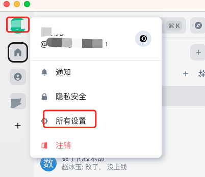
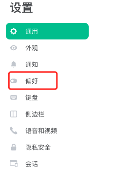
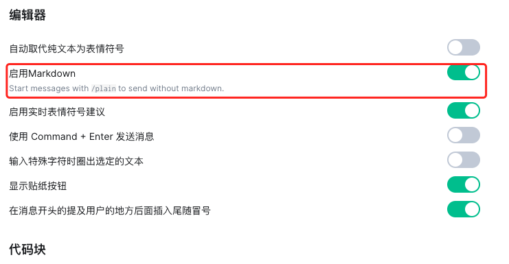
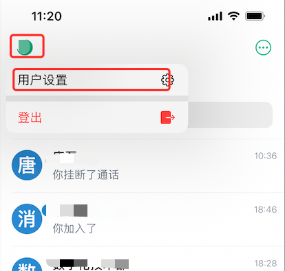
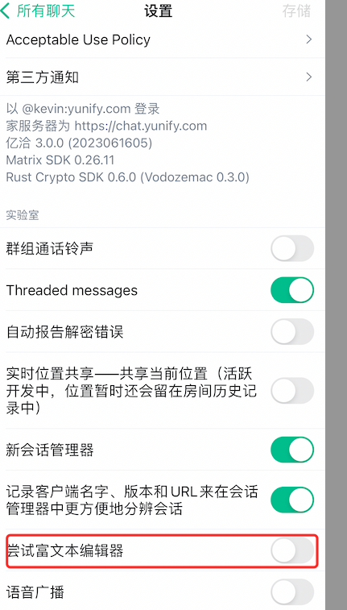

## 启用富文本支持

在我们的聊天过程中，通常需要分享一些文档或者长串的消息。通常情况下，消息的格式只限于文本或者文件，这样就需要下载文本来查看。对于长文本而言，由于没有格式定义，阅读起来可能会比较吃力。然而，如果我们开启富文本模式，就能够很好地解决这个问题。富文本模式支持使用Markdown格式，这样可以使您的消息内容更加整洁和具有条理性。

### 如何开启

### 桌面端开启

1. 在聊天主界面中点击头像，在下拉框中找到“所有设置”。如下图：

2. 在所有设置中找到“偏好”， 如下图：

3. 在偏好设置中，找到“编辑器” --> “启用Markdown”，将开关设为打开，如下图：

### iOS端开启

1. 在聊天主界面中点击头像，在下拉框中找到“用户设置”。如下图

2. 在用户设置中，找到富文本编辑开关，并将开关打开，如下图：

>  提示： 图中是关闭状态，请将开关设置为选中状态。