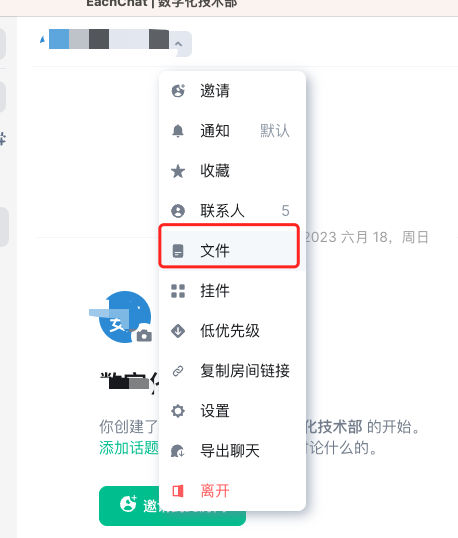
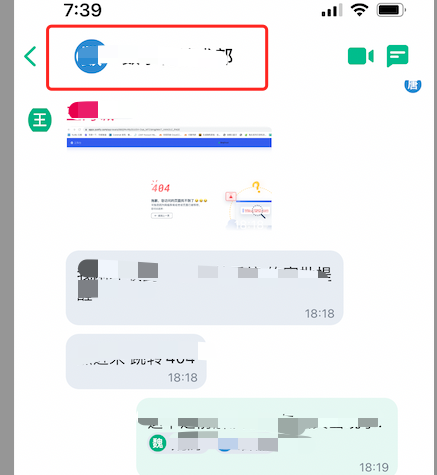
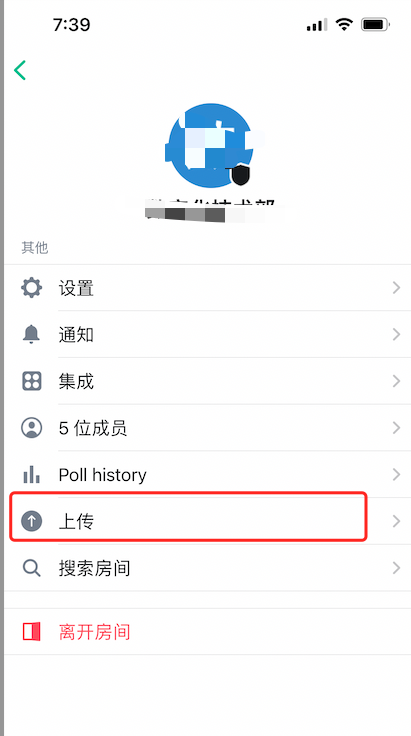
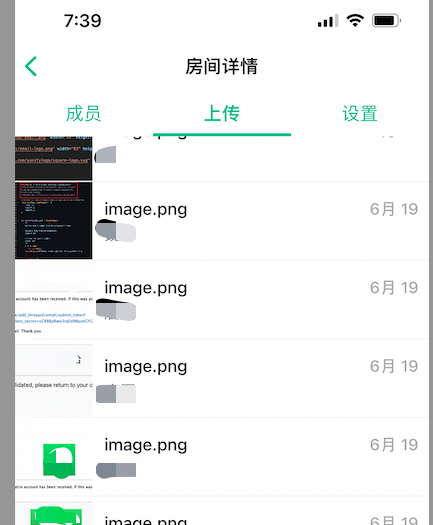

在繁多的聊天记录中找到所需的文件和图片并不容易。但是，在亿洽聊天房间中，您可以方便地查看所有的聊天附件，以便快速找到所需的文件和图片，节省您在翻阅聊天记录查找附件的时间。

## 如何使用

###  桌面版

1. 在您希望查看附件的聊天窗口中，找到聊天设置列表，在列表中找到“文件”，如下图：

2. 在弹出的边框中，可以列出当前聊天内的所有附件。

### iOS端

1. 在您需要查看附件的聊天窗口中找到设置列表，点击聊天房间名称可以列出，如下图：

2. 在下拉列表中找到附件选项 “上传” 如下图：

3. 点击“上传”后，在弹出的列表框中可以看到所有此聊天的附件，如下图：

