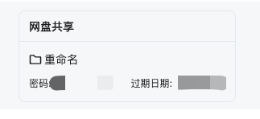

** 此功能仅支持青云内部使用，仅支持桌面端 **

在亿洽的桌面版中，您可以直接在聊天中分享青云网盘中的文件，同时还可以将聊天中的附件直接保存到网盘中。通过整合网盘功能，您可以减少在聊天过程中传输大文件时遇到的麻烦。这样一来，您可以更方便地分享和保存文件，节省时间和精力。

## 如何使用

### 共享文件给他人

1. 在聊天窗口内，找到网盘共享的图标，如下图:

2. 共享分为两种，分享链接和分配访问权限。

2.1. 分享链接 

2.1.1. 点击后在弹出的对话框中，点击右下角的“共享”，即可生成一个带有时效性和密码的分享链接，如下图所示：

2.1.2. 分享后的，会在聊天对话框中有个分享卡片，如下图：

2.2. 分配访问权限

2.2.1. 点击后，会弹出对话框，在对话框中选择文件，在右下角点击更多，并在弹出的对话框中选择想要分享的联系人，如下图：

2.2.2. 分享成功后，会收到分享成功的卡片

### 将附件上传到网盘

1. 在聊天窗口中找到您希望上传到网盘的聊天附件，如下图：

2. 点击保存到网盘按钮，在弹出的对话框中找到您要保存的位置，然后点击“保存至此”，如下图：

