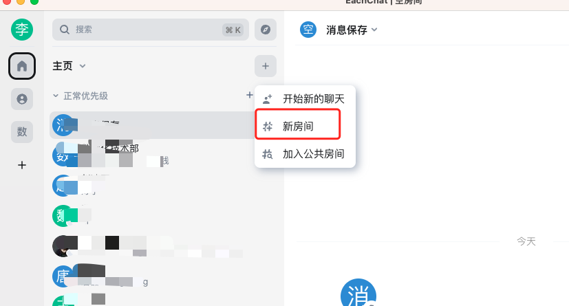
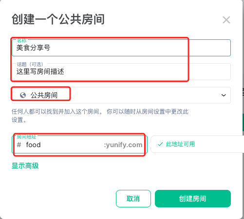
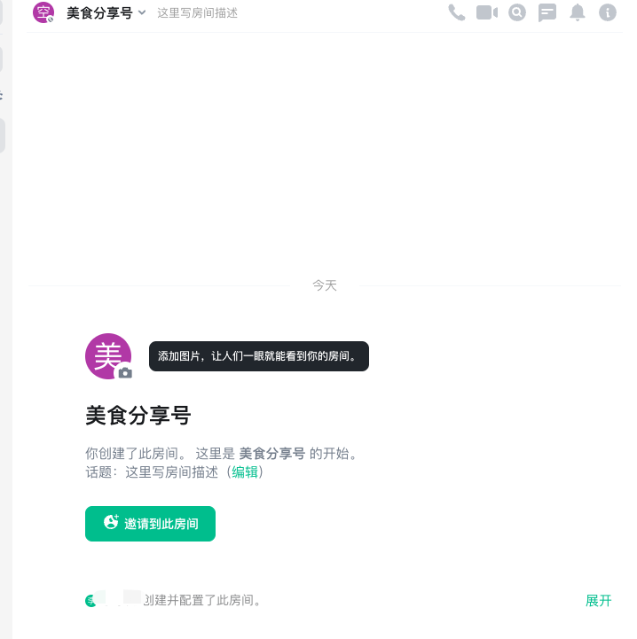
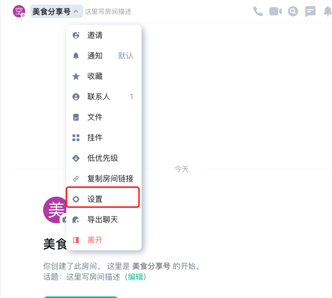
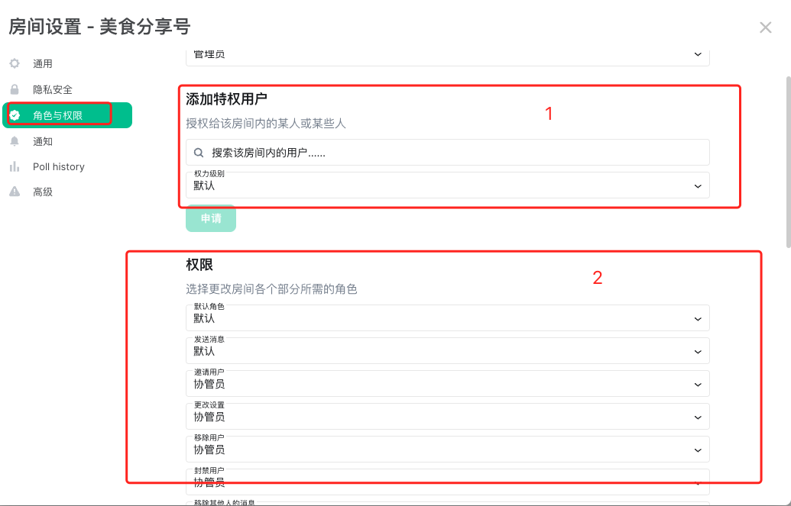

在工作和生活中，您可能会有分享自己的日常心得、短文动态、兴趣爱好等内容，在微信中可以通过朋友圈或公众号等平台来实现。而亿洽也提供了类似的功能，您可以创建一个公共房间，其他人只要感兴趣就可以加入。在这个公共房间中，您可以配置相应的权限，例如设置为只读或允许其他人发表评论和留言等。

## 如何使用

1. 首先您需要创建一个房间，如下图：

2. 创建一个公共房间，任何人都可以加入，如下图：

3. 这样您就创建好了一个公众号了，如下图：

## 控制权限

1. 你需要找到此房间的设置，如下图：

2. 在设置里找到“角色与权限”，并在此配置中，分配角色及配置权限，如下图：

>  解释：
>    - 序号1: 可以给房间里的联系人分配角色，比如将A联系人设置成管理员。
>    - 序号2: 根据角色，分配相应的权限，比如：只有协管员可以发送消息，将“发送消息”中的默认改为协管员。