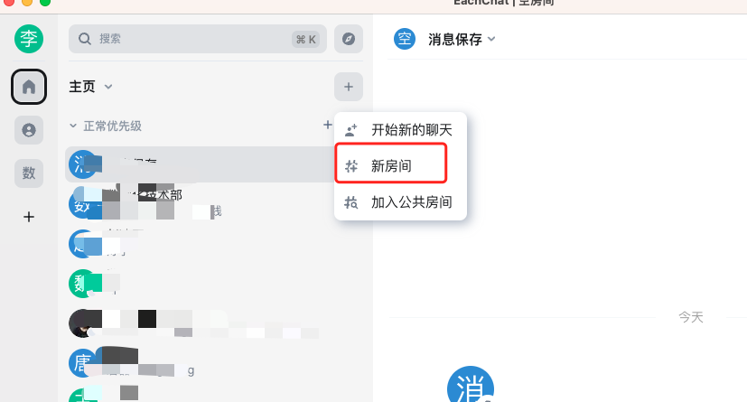
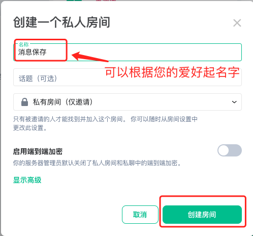

在工作和生活中，我们经常遇到需要在不同终端之间发送消息的情况。亿洽提供了解决方案，您可以创建一个私有聊天房间，无需邀请其他人加入。这样，您可以向该房间发送任何信息，只有您自己可以接收到。这为您提供了一个安全、独立的通信空间。

## 如何创建

1. 首先您需要创建一个房间，如下图:

2. 房间中只有您自己一个，不能添加其他任何人，给房间起个名字， 如下图：

这样您就可以向这个房间里发送任何消息，且只有您自己收得到消息。

>  注意：
>    - 一定不要添加联系人到这个房间。
>    - 房间必须是私有房间。