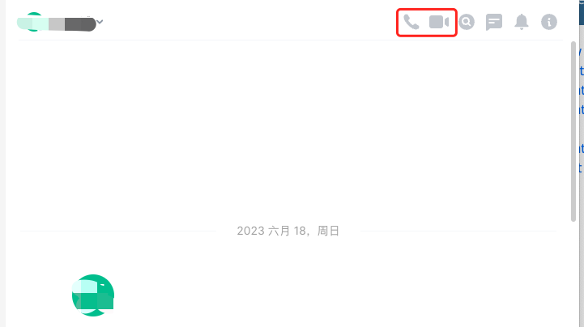
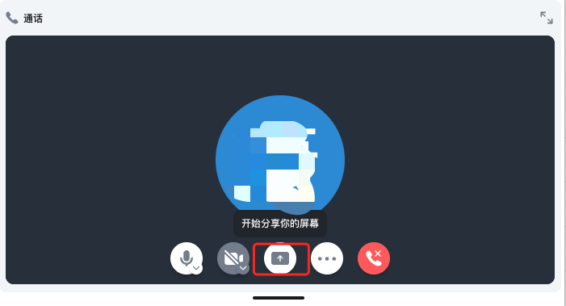
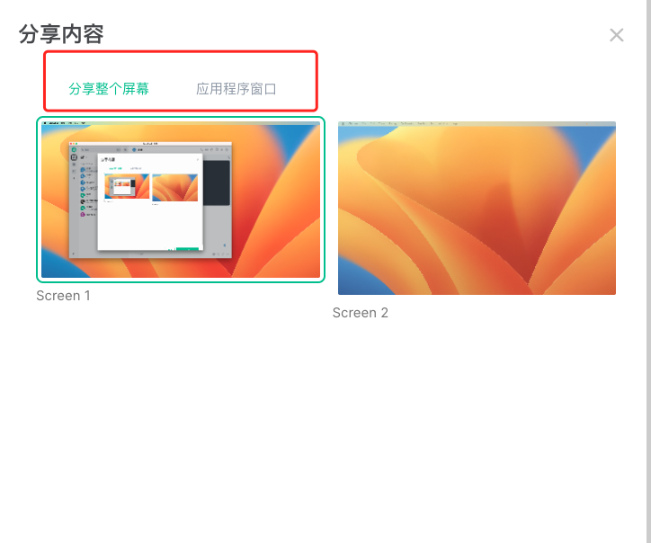

通常在日常的通话或视频过程中，我们可能需要展示文档、代码或屏幕等内容。我们通常的做法是通过截图或文字描述的方式，但这种方式效率较低且难以准确传达上下文。而亿洽在视频和语音聊天中提供了分享屏幕或应用的功能，可以有效地解决这个问题。通过这个功能，您可以直接展示您的屏幕内容，使沟通更加高效且便于理解。

## 如何使用

1. 在聊天窗口中打开语音通话/视频通话，如下图所示：

2. 在打开的通话/视频界面中，选择分享您的屏幕，如下图：

3. 您可以选择分配您的整个屏幕或者分享单个应用，如下图：

>  提示：
>     如果您使用的是Mac端的话，在分享开始，需要您给予亿洽录屏的权限，您可以直接在弹出的提示里打开Mac的系统设置中的录屏权限选项，也可以通过点击左上角Apple的图标在下拉框中找到“系统设置” --> "隐私与安全性" --> “录屏”， 在配置项中打开亿洽的录屏权限。