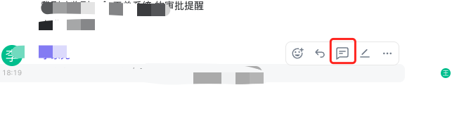
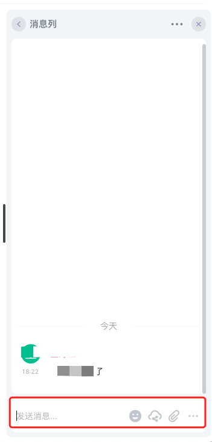

在聊天过程中，特别是在群组聊天中，随着聊天信息的增多，往往很难通过聊天记录找到相关的上下文。为了解决这个问题，亿洽在聊天房间内提供了消息列功能，使您能够轻松组织和保持聊天内容的有序性。这样，您就能够在后续回顾聊天内容时，更好地理清上下文，全面了解整个讨论过程。

通过消息列功能，您可以将相关的聊天信息进行归类、整理和分组， 以便更方便地进行复盘和查找。这样，您就能够更快速地找到之前的讨论记录，并从上下文中获取完整的信息。

亿洽的消息列功能为您提供了一个有效的组织工具，使聊天记录更加清晰和易于管理。无论是进行项目讨论、任务分配还是团队协作，您都能够更高效地回顾和复盘聊天内容，从而更好地理解和跟进讨论进程。

通过利用亿洽的消息列功能，您能够充分利用聊天记录，并且能够在需要时轻松地找到上下文，提高团队的沟通效率和工作效果。

## 如何使用

1. 在聊天窗口中，找的您想要回复的那条聊天记录，将焦点移动到改条记录上，会出现支持的动作，如下图：

2. 点击消息列按钮后，会弹出消息列对话框，所有在消息列中的聊天都会被统一列出，方便后续问题复盘，如下图：

