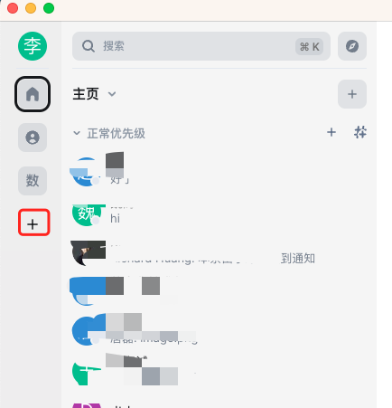
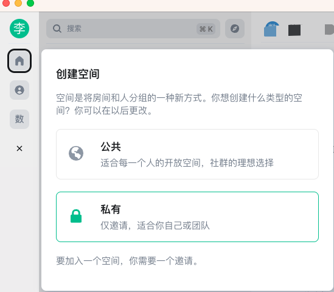

在繁多的联系人中查找特定人员常常耗费时间，尤其是在成立一个项目组时。传统的方法通常是创建群聊，但大量的联系人和群组会带来干扰。为了解决这个问题，我们可以利用亿洽的空间功能来管理联系人和项目信息。

在亿洽的主界面上，您可以创建一个空间来处理这些问题。对于机密项目，您可以创建一个私密空间，并在其中创建聊天房间，邀请相关项目人员加入。通过这样的方式，您可以在空间中找到与项目相关的所有聊天记录，不需要在繁杂的联系人中搜索。

对于公开项目，您可以创建一个公开空间，任何有兴趣了解项目的人都可以加入空间进行交流。通过创建公开空间，您可以让所有相关人员都可以方便地加入并参与聊天。

利用亿洽的空间功能，您可以更加高效地管理联系人和项目信息。不仅可以减少搜索时间，还可以保持项目信息的整洁和有序。这将为您的团队提供更好的协作环境，提高工作效率，并且能够更好地满足不同项目的安全和隐私需求。

## 如何使用

1. 需要在亿洽的聊天的主界面内找到创建空间的按钮

桌面端位置为

iOS端位置：

2. 点击创建后，会弹出一个对话框在对话框中选择创建的空间类型，如下图：

>  **空间类型：**
>
>    - 私有空间：仅通过邀请才能够加入，这类空间适用于管理部门聊天、项目组聊天等场景。
>    - 公开空间：所有人都可以加入，这类空间适用于社区管理，兴趣组管理等，有共同爱好的人都可以加入，并创建自己话题房间。
