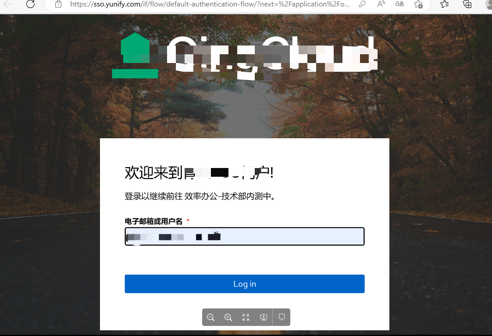
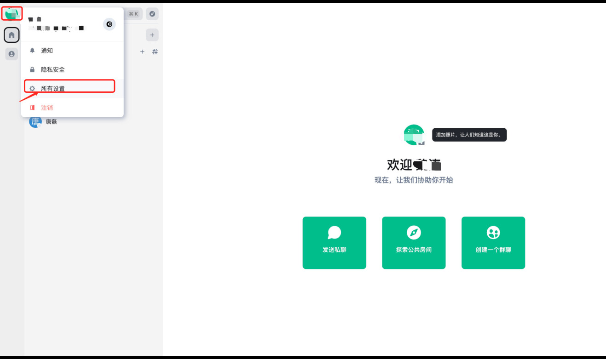

## 1. 安装

亿洽提供了MacOS客户端及Windows客户端。

### 1.1. 下载

您可以通过[下载链接](https://packages.yunify.com/)下载最新版桌面端。

### 1.2 MacOS客户端安装

1）找到下载到本地的安装包，并双击安装，在出现的窗口中，将EachChat应用拖到Applications文件夹内。

2）在launchpad中找到亿洽的应用，双击打开，会出现以下弹框，点击"**好"**继续，如下图所示：

3）出现上图这种警告，需要在"**隐私与安全性**"中打开允许，找到隐私与安全行路径："设置→ 隐私与安全性"向下划动找到如下图所示：

>
>  注意：这里mac系统版本不一样可能导致"隐私与安全性"的位置或者名称不一致，请自行根据的系统版本寻找!

4）选择点击"**仍要打开"**后，会出现一些安全性提示，请忽略这些提示，然后点击"**打开**"进入亿洽应用。

5）这里点击后将会提示你输入你自己电脑的密码或者指纹验证，验证之后，安装就能顺利完成！

### 1.3 Windows客户端安装

#### 1.2.1 下载

1）在Windows文件系统的下载目录找到EachChat Setup 3.0.0.exe, 双击exe文件运行进行安装，文件名称如下图所示：

2）点击运行后，WIndow系统可能会阻止了应用启动，选择"**仍要运行"**运行亿洽应用程序，如下图所示：

3）安装成功后会新增EachChat应用程序，如下图所示：

## 2. 登录

### 2.1 首次安装登录

1）完成安装后，找到应用程序并双击打开，可以进入登录界面，如下图所示：

2）点击 "**使用 青云SSO 继续**"，这里将会打开你的浏览器，并跳转到如下图所示的页面：

3）输入用户名和密码登录成功后会跳转到如下图所示的页面，点击"Continue"继续完成登陆。

4）MacOS版浏览器会提示您是否打开EachChat应用程序，这里选择"**打开EachChat"**。如下图所示：

5）完成上述操作后，即可打开亿洽的操作主界面，如下图所示：

### 2.2 登录新的客户端

**对于非第一次登陆亿洽并设置了之前设置了安全密钥请参考[高级功能](https://docs.yiqia.com/zh/docs/user-manual/mobile/ios/#4-高级功能)，需要您验证端合法性。**

1）点击图像打开"**隐私安全"**，进行安全密钥验证，如下图所示：

2）在隐私安全中找到有警告图标的会话，并点击"**验证"**进行客户端安全验证，如下图所示：

3）在弹出的对话框中点击使用安全密钥或短语进行验证，如下图所示：

4）在弹出的对话框中，输入安全短语，并点击"继续"，完成验证。如下图所示：

5）点击下图"**完成"**，完成客户端安全验证。

### 3. 使用说明

#### 3.1. 添加共享

为了能够更方便的让别人找到您，请设置邮箱共享。

##### 3.1.1 设置邮箱共享

1）点击左上角的头像，进入设置页面，点击所有设置，如下图所示：

2）进入页面后，将会看到一个添加邮箱，如下图所示：

3）在这里输入您自己的邮箱，点击添加，稍后你将会收到一封来治**EachChat**的邮件，如下图所示：

4）点击邮件中的链接，将会出现以下提示，如下图所示：

5）到这里说明你的邮件已经被核验，然后回到**EachChat**的桌面端，点击继续，如下图所示：

6）这时候会提示您"**使用单点登录继续**"，点击"**单点登录**"，如下图所示：

7）之后将会进行类似登陆时候的一些操作，当你看到这个一样的信息时，已经完成，，如下图所示：

8）关闭页面后将会看到如下图所示：

9）点击"**确认**"，到这里你将会看到邮箱已经完成添加，邮箱后面有"**移除**"按钮。如下图所示：

10）然后继续往下滑动窗口，你将会看到如下图所示：

11）点击"**共享**"按钮，这里会提示你是否信任 "**ids.yunify.com**"，如下图所示：

12）点击"**信任**"，稍后你将会收到一封来至**EachChat**的邮件，请点击如图所示 [Complete
email
verification](https://ids.yunify.com/_matrix/identity/api/v1/validate/email/submitToken?token=GwnVFwoLy8BRDcJnqphKvyXsZTgLngSU&client_secret=nNrtXullJoYjJ6zy3qAKFnTM2AvNTHna&sid=396112512)
蓝色字样，如下图所示：

13）点击蓝色链接文字，将会跳转返回如下图所示：

14）到这里说名你的邮箱共享已被认证，请回到桌面端，点击"**完成**"，如下图所示：

15）点击完成之后，完成按钮将会变成红色的撤销按钮，如下图所示：

16）如果，点击完成按钮之后没有变化，但也无其它报错提示，请退出设置，从新点击头像里面的设置进入查看，之前的共享按钮是否已经变成红色撤销。如果共享这里依旧未能变化撤销状态，请联系管理员！

到这里关于邮箱的基本设置已经完成！您可以开始尝试寻找其它人进行沟通！

#### 3.2.邀请他人聊天
1）在亿洽的主聊天界面，使用"**开始新的聊天"**进行添加，具体操作图示如下：

1）这里，假如你知道对方的亿洽ID，你则可以通过如图所示里面的亿洽ID冒号后面的部分样例文字"**\@user:example.com**"进行寻找(英文冒号)，或者你可以选择直接输入对方的邮箱（前提是对方也开起了邮箱共享）进行查询。

2）选择列出里面你需要找的人，并发出邀请，等待对方接受邀请后，则可以正常聊天了，如下图所示：

## 4. 高级功能

亿洽同时具备一些高级功能，它可以通过配置安全密钥，可以同时支持多端同时登录，并且能够保证所有聊天内容在各登录端无缝漫游，不用担心错过重要信息。

#### 4.1 设置安全密钥

1）在主聊天界面点击头像进入"**隐私安全**"，具体操作图示如下：

2） 进入"**隐私安全**"后，在设置列表中找到"**加密**"选项，并点击进入，具体操作图示如下:

3） 如何配置安全密钥请参考 [iOS端高级功能](http://docs.yiqia.com/docs/user-manual/ios/#advance)

## 注意事项

**1、在添加邮箱，共享邮箱的操作中，建议登陆公司web端邮箱，第三方邮箱客户端可能因某些原因导致收邮件延迟或者收件失败，这时请不要多次重复尝试发送邮件。**