# 1. 安装

1） iOS端可以通过Apple的App Store进行安装，首先您需要打开Apple的App Store，可以通"亿洽"、"EachChat"、"YiQia"等类似关键字搜索到亿洽App并安装，当前最新版本为3.0.0 具体操作图示如下：

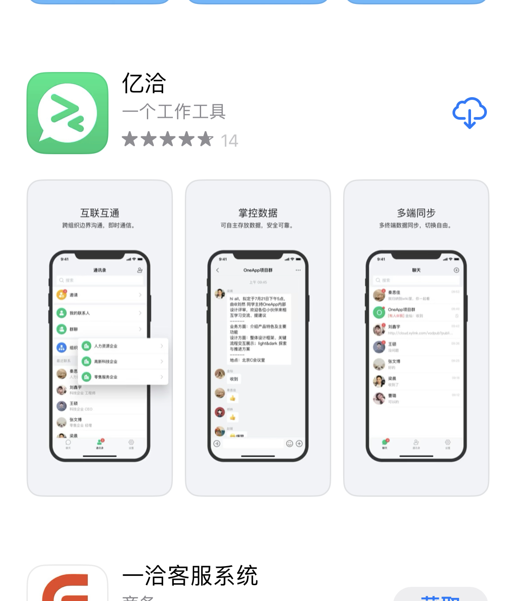

2） 安装完成后，您的iPhone/iPad里会看到已经安装的应用，具体操作图示如下：

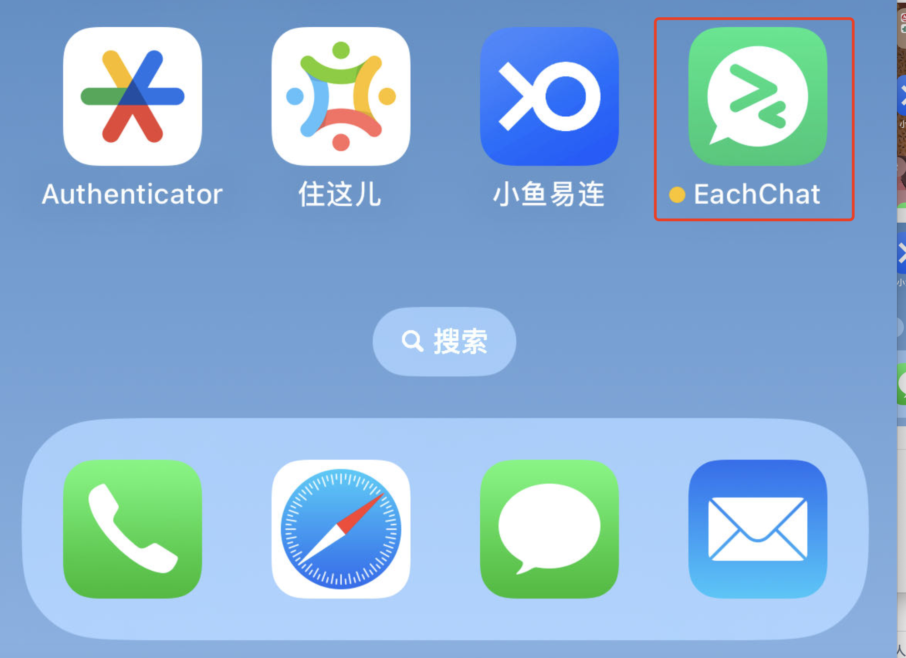

# 2. 登录

# 2.1 首次登录亿洽

1） 打开您安装的亿洽的App会进入一个欢迎界面，点击"**开始**"按钮，进入亿洽的登录界面，具体操作图示如下：

2） 亿洽对青云内部员工使用的是青云SSO进行统一登录，点击"**使用 青云SSO 继续**"即可进入到青云SSO的认证界面。具体操作图示如下：

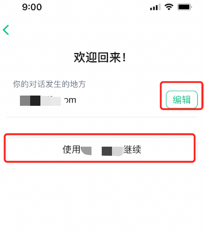

3） 在弹出的对话框中点击"继续"，会进入到青云SSO的登录流程，输入青云内部的账号和密码完成青云SSO登录流程后即可进入亿洽的App系统，具体操作图示如下：

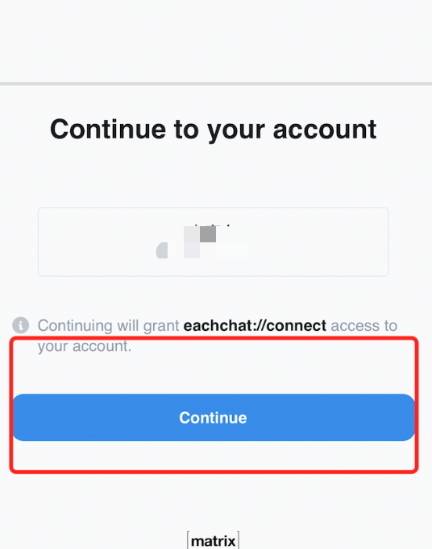

4） 您登录到亿洽系统后，在弹出的对话框中点击"允许"按钮允许亿洽向您发送通知，否则您可能会错过很多亿洽的消息，具体操作图示如下：

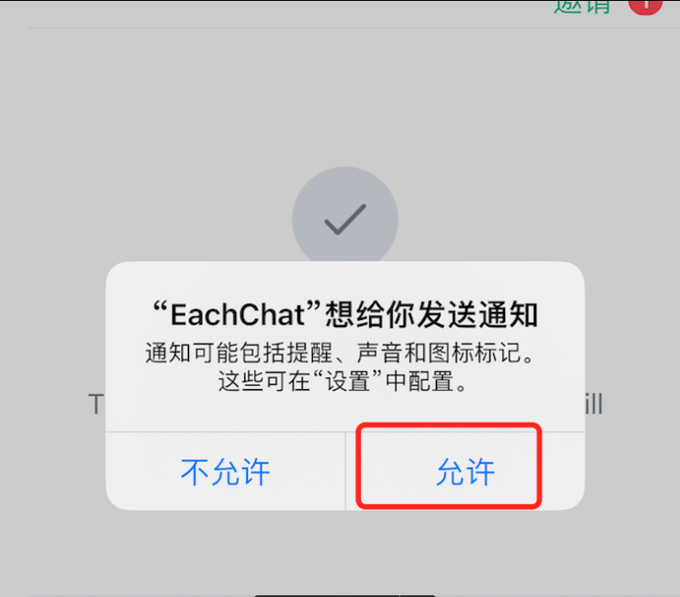

## 2.2 登录新设备

**如果您在新设备的客户端登录并且之前设置了安全密钥请参考[高级功能](#advance)，需要您验证端合法性。**

1） 在新的iPhone和iPad上登录亿洽会收到检验会话提示，点击"**使用安全词组或密钥"**。具体图示如下：

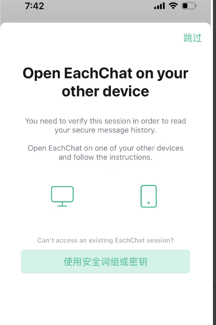

2） 点击完成后会提示你输入安全词组，并点击"使用词组"进入新的客户端，具体操作如下图所示：

3） 完成输入"安全词组"后，会弹出完成窗口，点击"好了"完成验证，具体操作如下图所示：

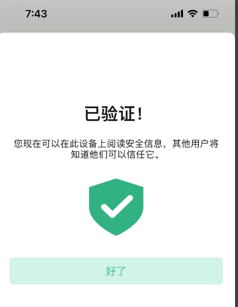

#  3. 使用

## 3.1. 添加联系人

亿洽可以通过两种途径添加联系人，第一种是通过青云小助手添加联系人，第二种是通过亿洽ID搜索联系人。

### 3.1.1. 通过青云小助手查找

此功能仅限青云内部员工使用，内部员工请参考[青云内部wiki](https://cwiki.yunify.com/pages/viewpage.action?pageId=160710062)

### 3.1.2 通过亿洽ID发起邀请

#### 3.1.2.1 前提

1）您需要知道，被邀请人的邮箱地址前缀，比如user@example.com，亿洽的ID是：@user:example.com；

2）联系人需要在亿洽中登录过系统。

#### 3.1.2.2 添加联系人

1）在亿洽的主聊天界面，使用"**开始聊天"**进行添加，具体操作图示如下：

2）在弹出的对话框中输入您要找的人亿洽的ID，然后点击"+"进入聊天，具体操作图示如下：

3）点击"**开始**"，进入聊天对话框，具体操作图示如下：

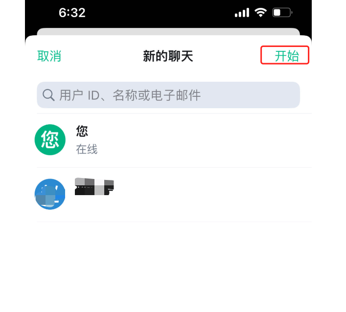

4）在聊天对话框中输入消息，联系人会收到消息，等待联系人的确认即可开启新的聊天会话，具体操作图示如下：

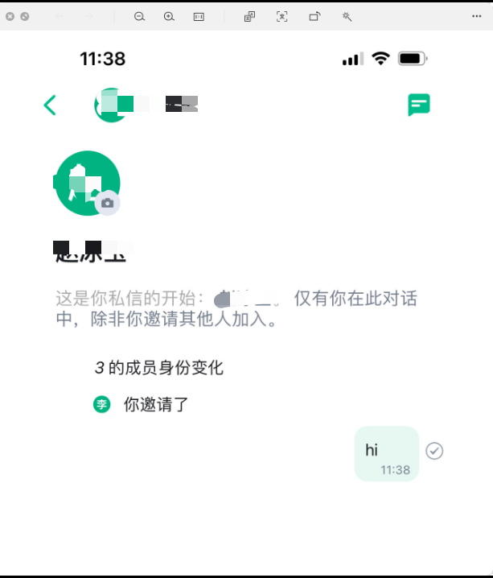

## 3.2 创建聊天房间

亿洽的创建房间功能等同于微信的群组、slack等工具的channel。

### 3.2.1 创建房间

1）在亿洽的聊天主界面中使用"**创建房间"**按钮来创建房间，具体操作图示如下：

2）在打开后会弹出房间信息对话框中，填入必要信息，并点击右上角"**新建**"，内容图后有解释，具体操作图示如下：

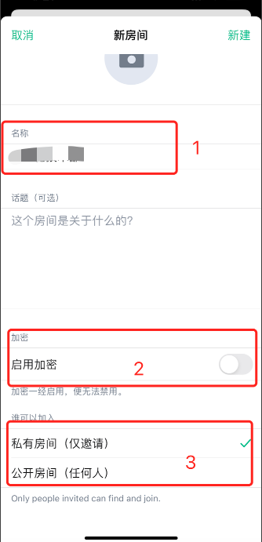

>  解释：
>   1.  输入房间名称。
>   2.  是否对房间启动加密，如果启动加密将不能回退，请牢记加密的密钥串和密钥短语。
>   3.  空间权限，私人房间为仅邀请可以加入，公开房间所有人都可加入。

3）点击"新建"后，会看到列表中有您创建好的房间了，具体操作图示如下：

### 3.2.2 邀请联系人加入房间

1）在聊天列表中找到房间名，并进入房间就可以看到"**添加人员**"按钮，可以添加联系人，具体操作图示如下：

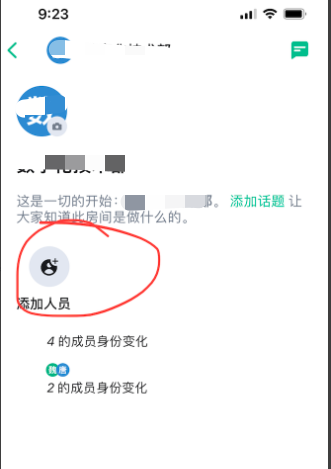

2）点击"**添加人员**"邀请联系人进入房间，具体操作图示如下：

3）在弹出的对话框中，点击"**确认**"，加入房间，具体操作图示如下：

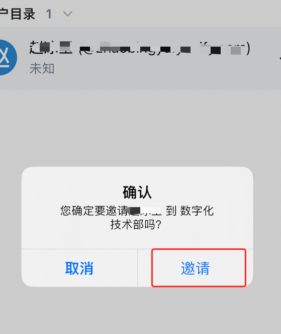

4）至此可以在房间内进行聊天了。

## 4. 高级功能 

亿洽同时具备一些高级功能，它可以通过配置安全密钥，可以同时支持多端同时登录，并且能够保证所有聊天内容在各登录端无缝漫游，不用担心错过重要信息。

### 4.1 设置安全密钥

1）在主聊天界面点击头像进入"**用户设置**"，具体操作图示如下：

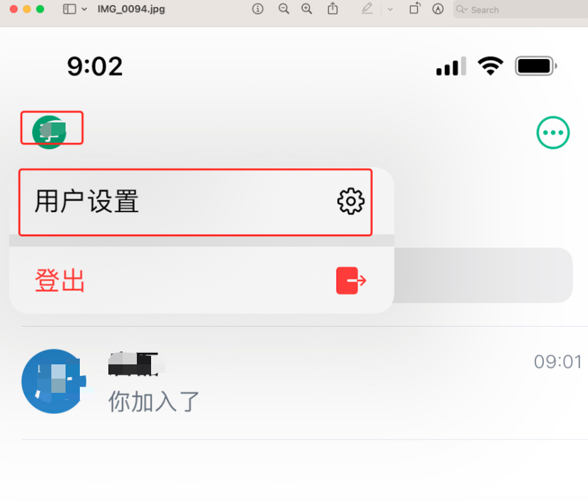

2）进入"**用户设置**"后，在设置列表中找到"安全"选项，并点击进入，具体操作图示如下：

3）点击"**设置**"来配置您的安全密钥备份，具体操作图示如下：

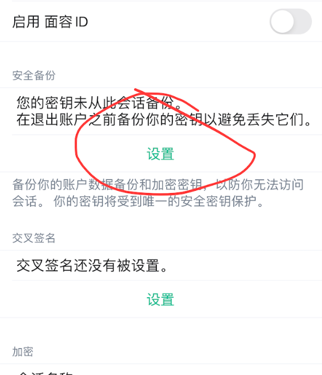

4）在弹出对话框中选择密钥备份方式，我们强烈建议您"**使用安全词组**"进行备份，这样就不用记复杂的密钥串了，具体操作图示如下：

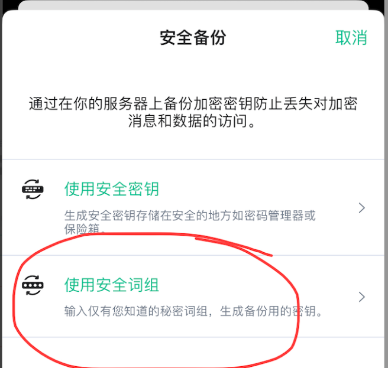

5）如果您选择"**使用安全词组**"进行备份，弹出输入对话框，依次输入词组及确认词组，并点击"继续"，具体操作图示如下：

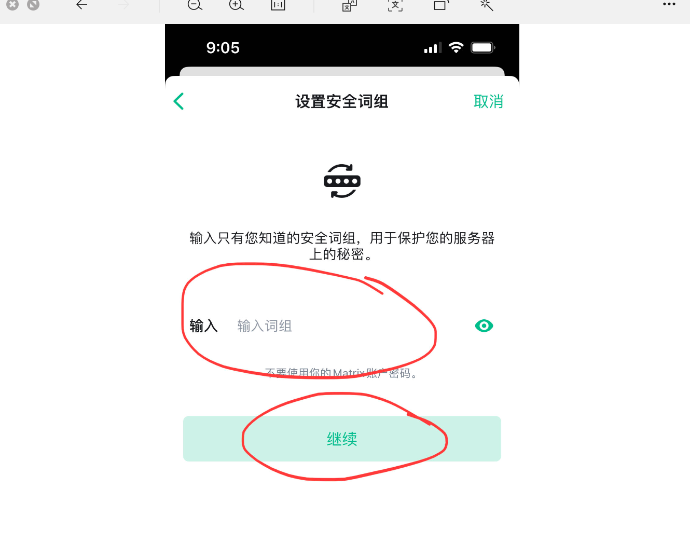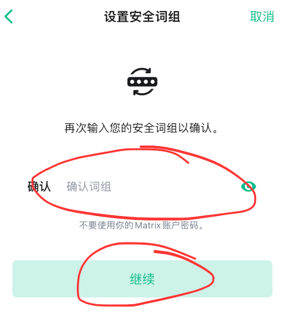

6）会弹出一个青云SSO的登录确认界面，输入用户名和密码后登录成功后，关闭页面，具体操作图示如下：

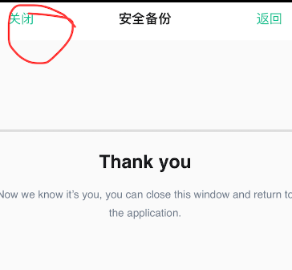

7）关闭后，会弹出一个保存密钥窗口，强烈建议您保存您的密钥，因为密钥下载只出现一次，丢失后无法保存，具体操作图示如下：

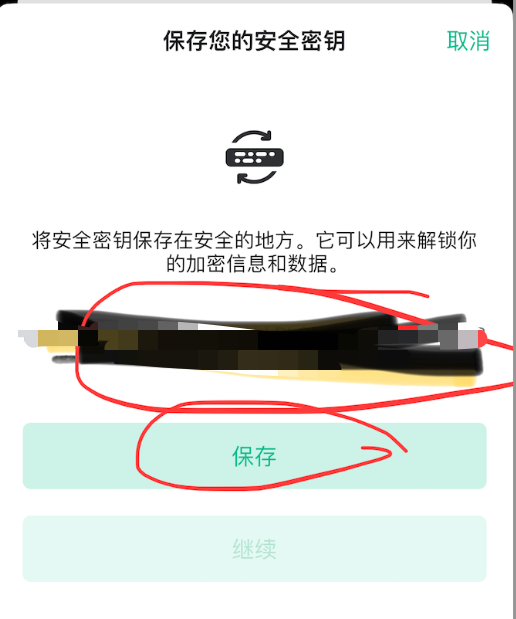

8）保存完成后，点击继续完成，密钥备份，具体操作图示如下：

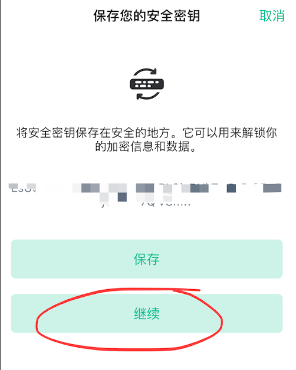

9）至此，所有的安全密钥设置完成。

# 注意事项

第一条：强烈建议您不要使用IOS端的邮件及手机号的分享功能，此功能有BUG，无法正常关闭最后的确认窗口，请使用桌面版或者WEB版进行邮件分享动作。如下图位置：

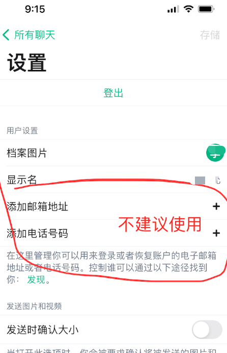