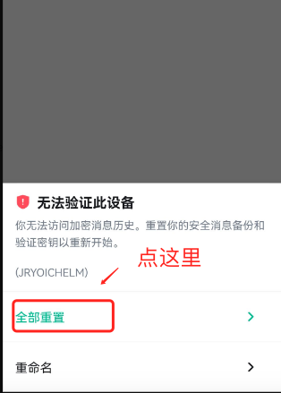
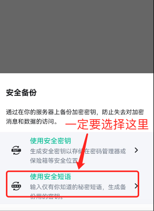

# 1. 安装

1）下载安卓客户端地址点[这里](https://packages.yunify.com/android/)

2）点击下载后的apk文件，根据提示进行安装。

# 2. 登录

## 2.1. 首次登录

1）安装完成后，需要登录亿洽系统，登录方式可以参考iOS端的登录方法，这里不再赘述。

2）登录亿洽安卓端后，如果您在其他端没有登录过亿洽或者没有配置安全密钥的话，可能会遇到点击提示界面挂起的问题，如下图所示：

3）退出亿洽进程，使用安卓系统的进程管理，杀掉进程，重新打开亿洽，不要点击验证提示，通过触碰右滑退出提示，如下图：

4）点击头像，打开用户设置，用来设置加密密钥，如何打开用户设置见下图：

5）在用户设置中找到“安全与隐私”，并打开选项，如下图：

6）在”安全与隐私“中，找到“”选项，并点击“恢复已加密消息”设置恢复密钥短语，如下图所示：

7）点击后会出现“当前会话”对话框，如下图：

8）点开列表中的会话，会弹出一个验证对话，点击全部重置，如下图：

9）会弹出安全密钥选择对话框，请一定要选择“使用安全短语”，如下图：

10）根据系统提示，填写密钥短语后，SSO验证后，即可完成所有配置。

# 3. 使用方法

除个别排列方式不同，使用方法请参考[iOS端使用](https://docs.yiqia.com/zh/docs/user-manual/mobile/ios/#3-使用)，