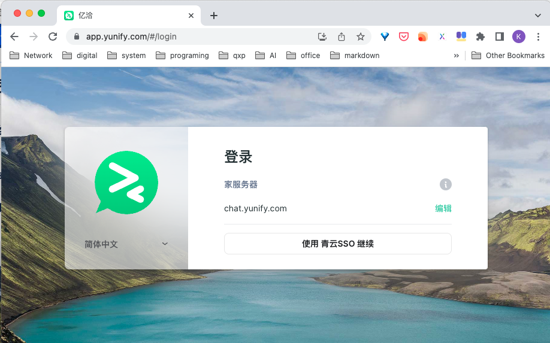

## 1. 登录

1） 打开您的浏览器，在地址栏输入亿洽Web端地址： [https://app.yunify.com](https://app.yunify.com/)，对于青云内部员工点击 "使用 青云SSO 继续“进行登录使用，外部人员请修改“HomeServer”的地址登录您自己的服务器。

2） 打开“青云SSO”的登录界面后，根据提示输入用户名和密码，登录到亿洽系统中，具体青云SSO的登录方式可以参考iOS端或者桌面端登录步骤。

因Web端同桌面端的所有功能相同，请参考桌面端登录：[登录](https://docs.yiqia.com/zh/docs/user-manual/desktop/#2-登录)

## 2. 使用说明*

因Web端同桌面端的所有功能相同，请参考桌面端的使用说明：[使用说明](https://docs.yiqia.com/zh/docs/user-manual/desktop/#3-使用说明) 

## 3. 高级功能

请参考桌面端的高级功能：[高级功能](https://docs.yiqia.com/zh/docs/user-manual/desktop/#4-高级功能)